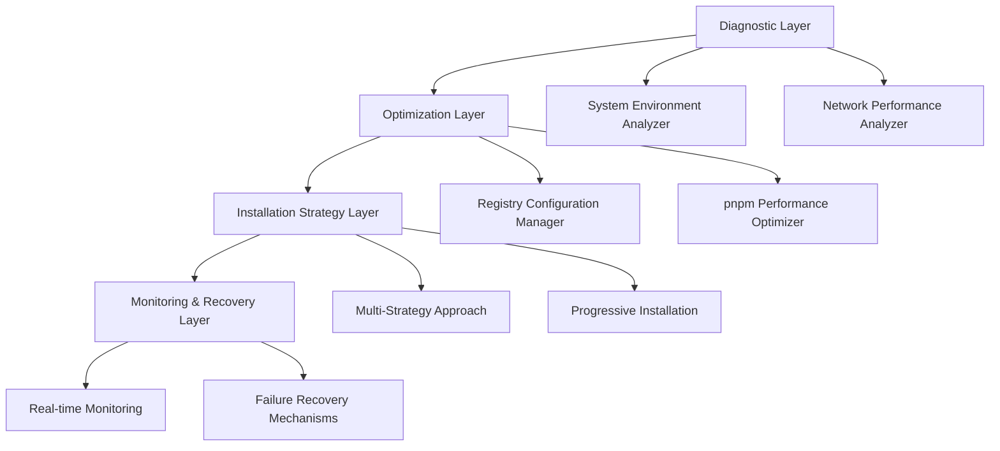

# Architecture Documentation

## Payload Installation Performance Optimization

This directory contains comprehensive documentation for diagnosing and resolving Payload CMS installation performance issues.

### Documents Overview

#### 1. [Payload Installation Performance Optimization](./payload-installation-performance-optimization.md)
**Main Architecture Document**
- Complete system architecture for installation optimization
- Multi-layer approach with diagnostic, optimization, and recovery components
- Performance targets and success metrics
- Risk assessment and mitigation strategies

#### 2. [Payload Installation Scripts](./payload-installation-scripts.md)
**Implementation Scripts**
- Ready-to-use bash scripts for immediate fixes
- Monitoring and diagnostic tools
- Alternative installation methods
- Recovery and cleanup procedures

#### 3. [Payload Installation Troubleshooting](./payload-installation-troubleshooting.md)
**Troubleshooting Guide**
- Common issues and solutions
- Error code reference
- Advanced diagnostic procedures
- Prevention strategies and best practices

### Quick Start

For immediate resolution of slow Payload installation:

1. **Quick Fix** (2 minutes):
   ```bash
   # Clear cache and optimize settings
   pnpm store prune
   pnpm config set network-timeout 600000
   pnpm config set fetch-retries 10
   export NODE_OPTIONS="--max-old-space-size=4096"
   
   # Retry installation
   pnpx create-payload-app@latest
   ```

2. **System Check** (5 minutes):
   ```bash
   # Check system resources
   free -h  # Should have 4GB+ available
   df -h .  # Should have 2GB+ free space
   node --version  # Should be 18.20.2+
   pnpm --version  # Should be 9.0.0+
   ```

3. **Alternative Registry** (if still slow):
   ```bash
   pnpm config set registry https://registry.npmmirror.com/
   pnpx create-payload-app@latest
   ```

### Architecture Summary

The solution implements a **4-layer architecture**:



### Implementation Phases

#### Phase 1: Immediate Fixes (0-1 hour)
- Registry optimization
- System resource verification
- Cache cleanup

#### Phase 2: Enhanced Installation (1-2 hours)
- Custom installation scripts
- Fallback mechanisms
- Progress monitoring

#### Phase 3: Long-term Optimization (2-4 hours)
- Monitoring dashboard
- Automated recovery
- Performance baselines

### Success Metrics

- **Installation Time**: < 10 minutes for complete setup
- **Success Rate**: > 95% first-attempt success
- **Recovery Time**: < 2 minutes for automatic recovery
- **Resource Usage**: < 2GB RAM, < 50% CPU during installation

### Risk Mitigation

**High-Risk Scenarios:**
- Network instability → Multiple registry mirrors, offline cache
- Memory exhaustion → Memory monitoring, garbage collection
- Dependency conflicts → Version pinning, compatibility checks

**Medium-Risk Scenarios:**
- Slow registry response → Registry performance testing
- Firewall/proxy issues → Proxy detection and configuration

### Support and Maintenance

#### Regular Maintenance Tasks
- Registry performance monitoring
- Cache cleanup and optimization
- Configuration updates for new pnpm versions

#### When to Use This Documentation
- Payload installation hangs or fails
- Network timeout errors during installation
- Memory exhaustion during dependency resolution
- Setting up new development environments
- Troubleshooting CI/CD pipeline issues

#### Related Documentation
- [Complete Directory Structure](./complete-directory-structure.md)
- [Task Management Guidelines](../../.kilocode/rules/task-management.md)
- [Memory Bank Tasks](../../.kilocode/rules/memory-bank/tasks.md)

### Contributing

When updating this documentation:
1. Test all scripts on different environments
2. Update version compatibility matrices
3. Add new error codes and solutions as discovered
4. Maintain performance benchmarks
5. Update risk assessments based on real-world usage

---

*This architecture documentation provides a comprehensive solution for Payload CMS installation performance issues, ensuring reliable and fast project initialization across different environments and network conditions.*