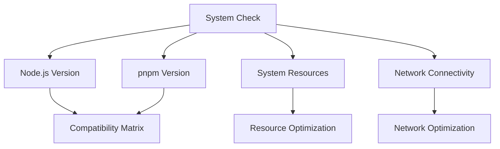
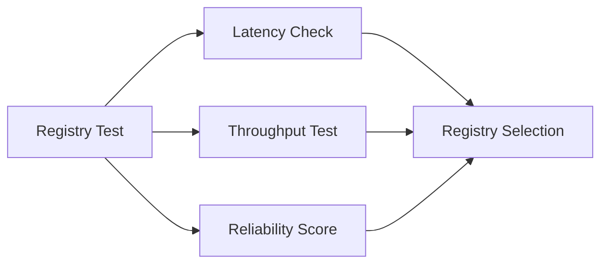
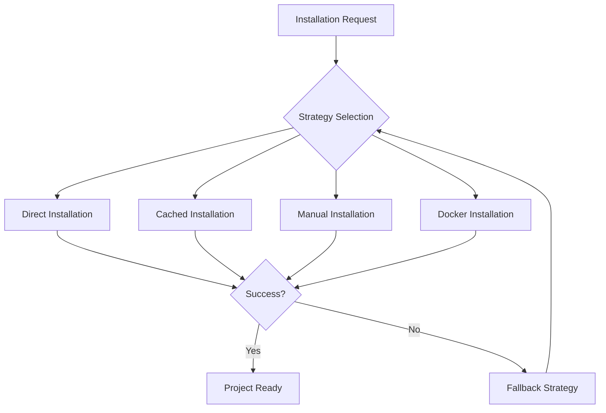
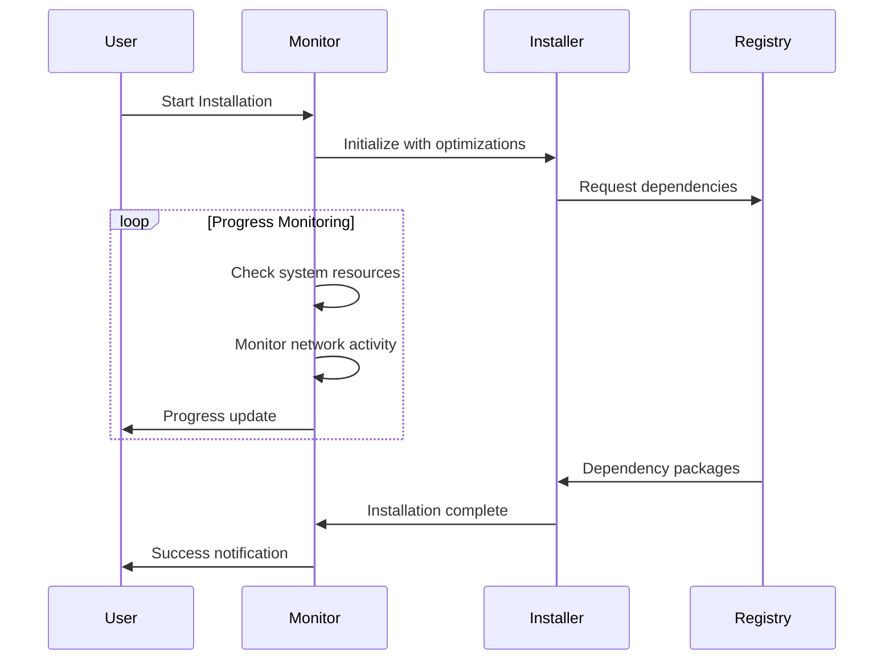
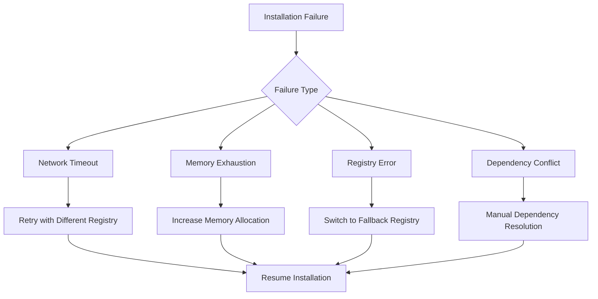

# Payload CMS Installation Performance Optimization Architecture

## Overview

This document outlines the comprehensive architecture for diagnosing and resolving slow Payload CMS installation issues, specifically targeting the `pnpx create-payload-app@latest` command performance bottlenecks.

## Problem Statement

### Current Issue
- `pnpx create-payload-app@latest` installation hanging during dependency resolution
- Third installation attempt indicating persistent performance issues
- No `pnpm-lock.yaml` or `node_modules` directory created, confirming incomplete installation

### Impact Assessment
- **Development Velocity**: Blocked project initialization
- **Resource Utilization**: Wasted developer time and system resources
- **Project Timeline**: Delayed project kickoff and development cycles

## Architecture Components

### 1. Diagnostic Layer

#### 1.1 System Environment Analyzer


**Components:**
- Node.js version compatibility checker
- pnpm configuration validator
- System resource monitor (RAM, CPU, Disk)
- Network connectivity tester

#### 1.2 Network Performance Analyzer


**Metrics:**
- Registry response time
- Download throughput
- Connection stability
- Proxy/firewall detection

### 2. Optimization Layer

#### 2.1 Registry Configuration Manager
```yaml
# Optimal Registry Configuration
primary_registry: "https://registry.npmjs.org/"
fallback_registries:
  - "https://registry.npmmirror.com/"
  - "https://npm.taobao.org/"

performance_settings:
  network_timeout: 300000
  fetch_retries: 5
  fetch_retry_mintimeout: 10000
  fetch_retry_maxtimeout: 60000
  prefer_offline: true
  progress: true
```

#### 2.2 pnpm Performance Optimizer
```bash
# Performance Configuration
pnpm config set store-dir ~/.pnpm-store
pnpm config set cache-dir ~/.pnpm-cache
pnpm config set network-concurrency 16
pnpm config set child-concurrency 5
pnpm config set network-timeout 300000
```

### 3. Installation Strategy Layer

#### 3.1 Multi-Strategy Approach


**Strategy Priority:**
1. **Optimized Direct**: Enhanced `create-payload-app` with optimizations
2. **Cached Installation**: Pre-downloaded dependencies
3. **Manual Setup**: Step-by-step dependency installation
4. **Docker Container**: Containerized environment
5. **Template Clone**: Clone and modify existing project

#### 3.2 Progressive Installation Architecture


### 4. Monitoring and Recovery Layer

#### 4.1 Real-time Monitoring System
```typescript
interface InstallationMonitor {
  systemResources: {
    memory: MemoryUsage;
    cpu: CPUUsage;
    disk: DiskUsage;
  };
  networkActivity: {
    downloadSpeed: number;
    packagesDownloaded: number;
    totalPackages: number;
  };
  timeouts: {
    elapsed: number;
    estimated: number;
    threshold: number;
  };
}
```

#### 4.2 Failure Recovery Mechanisms


## Implementation Plan

### Phase 1: Immediate Fixes (0-1 hour)
1. **Registry Optimization**
   - Configure fastest available registry
   - Set optimal timeout and retry values
   - Clear corrupted cache

2. **System Resource Check**
   - Verify available memory (minimum 4GB recommended)
   - Check disk space (minimum 2GB free)
   - Close unnecessary applications

### Phase 2: Enhanced Installation (1-2 hours)
1. **Custom Installation Script**
   - Pre-flight system checks
   - Optimized pnpm configuration
   - Progress monitoring and logging

2. **Fallback Mechanisms**
   - Alternative installation methods
   - Manual dependency installation
   - Docker-based setup

### Phase 3: Long-term Optimization (2-4 hours)
1. **Monitoring Dashboard**
   - Real-time installation progress
   - System resource utilization
   - Network performance metrics

2. **Automated Recovery**
   - Failure detection and automatic retry
   - Strategy switching based on failure type
   - Performance baseline establishment

## Risk Mitigation

### High-Risk Scenarios
1. **Network Instability**
   - **Mitigation**: Multiple registry mirrors, offline cache
   - **Recovery**: Automatic registry switching

2. **Memory Exhaustion**
   - **Mitigation**: Memory monitoring, garbage collection
   - **Recovery**: Process restart with increased allocation

3. **Dependency Conflicts**
   - **Mitigation**: Version pinning, compatibility checks
   - **Recovery**: Manual resolution with fallback versions

### Medium-Risk Scenarios
1. **Slow Registry Response**
   - **Mitigation**: Registry performance testing
   - **Recovery**: Dynamic registry selection

2. **Firewall/Proxy Issues**
   - **Mitigation**: Proxy detection and configuration
   - **Recovery**: Alternative download methods

## Success Metrics

### Performance Targets
- **Installation Time**: < 10 minutes for complete setup
- **Success Rate**: > 95% first-attempt success
- **Recovery Time**: < 2 minutes for automatic recovery
- **Resource Usage**: < 2GB RAM, < 50% CPU during installation

### Quality Indicators
- Zero manual intervention required
- Consistent performance across different environments
- Comprehensive error reporting and recovery
- Automated optimization based on system capabilities

## Testing Strategy

### Unit Tests
- Registry connectivity tests
- System resource validation
- Configuration optimization verification

### Integration Tests
- End-to-end installation scenarios
- Failure recovery mechanisms
- Performance under various network conditions

### Load Tests
- Concurrent installation handling
- Resource exhaustion scenarios
- Network bandwidth limitations

## Maintenance and Updates

### Regular Maintenance
- Registry performance monitoring
- Cache cleanup and optimization
- Configuration updates based on new pnpm versions

### Update Procedures
- Payload CMS version compatibility checks
- Dependency security updates
- Performance optimization refinements

## Conclusion

This architecture provides a comprehensive solution for Payload CMS installation performance issues, with multiple layers of optimization, monitoring, and recovery mechanisms. The implementation prioritizes immediate fixes while building toward a robust, self-healing installation system.

The multi-strategy approach ensures high success rates across different environments and network conditions, while the monitoring and recovery systems provide visibility and automatic problem resolution.